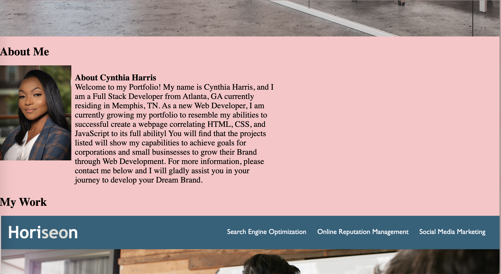

# Cynthia-Career-Portfolio

This project is focused on creating a deployed portfolio of my personal work samples for future employment. I primarily want employers to see my personal info from my headshot, work samples, and contact me links to view my resume and repository. In this codebase, you will find capabilities of UI scrolling to corresponding sections and direct links to my applications. While viewing the deployed application on a web browser, you will be able to view the site on various screens and devices with a responsive layout set to create a simple viewing experience.

Below are the images of my deployed portfolio:

Here is the URL to access the image directly:
<a href="https://gracetalks.github.io/01-Challenge-Horiseon/">Visit Horiseon!</a>